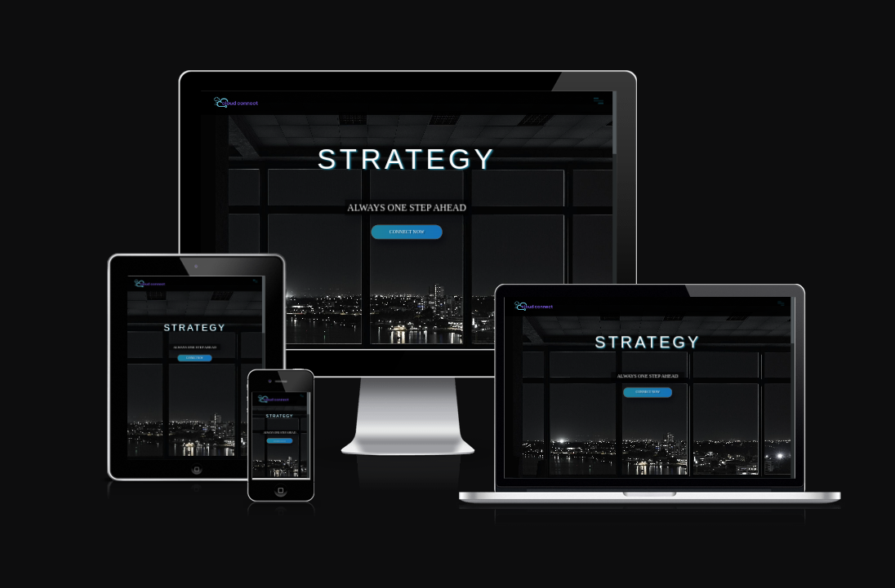

# **CLOUD CONNECT CONSULTANCY**

[Link to Live Project](https://codeconnoisseur74.github.io/cloud-connect-consultancy/)

## Table of Contents
- [**CLOUD CONNECT CONSULTANCY**](#cloud-connect-consultancy)
  - [Table of Contents](#table-of-contents)
  - [Introduction](#introduction)
  - [Updates](#updates)
  - [UX](#ux)
    - [User Stories](#user-stories)
  - [Features](#features)
    - [Dropdown Menu](#dropdown-menu)
    - [Connect Button](#connect-button)
    - [Contact Form](#contact-form)
    - [Footer](#footer)
    - [Performance](#performance)
    - [Security](#security)
    - [Features Left to Implement](#features-left-to-implement)
    - [Technologies Used](#technologies-used)
    - [Languages Used](#languages-used)
    - [Frameworks, Libraries \& Programs Used](#frameworks-libraries--programs-used)
  - [Testing](#testing)
    - [W3S Jigsaw CSS Validator](#w3s-jigsaw-css-validator)
    - [JSHint Validation](#jshint-validation)
  - [Deployment](#deployment)
    - [GitHub Pages](#github-pages)
    - [Forking the GitHub Repository](#forking-the-github-repository)
    - [Cloning the GitHub Repository](#cloning-the-github-repository)
  - [Credits](#credits)
    - [Code](#code)
    - [Content](#content)
    - [Media](#media)
    - [Other](#other)

## Introduction
World Weather is a weather website where the user can search for the current weather by city. The background image correspods with a random image of that city is fetched from unsplash.com. Current weather information includes: temprature in celcius, cloud status, humidity and windspeed. This weather data is fetched from openweatherapp.org. The site allows the user to quickly access current weather information of any major city worldwide whilst a corresponding image is provided to the user in realtime. The site is responsive to any size desktop, tablet or smartphone device.

[The live project can be found here.](https://codeconnoisseur74.github.io/cloud-connect-consultancy/)
## UX

### User Stories

| ID  | As a...        | I Want To Be Able To...                                            | So That I Can...                                                                                              |
| --- | -------------- | ------------------------------------------------------------------ | ------------------------------------------------------------------------------------------------------------- |
| 01  | As a potential business client  | have access to short descriptions of services                            | can quickly make decisions on the services pertaining to my business needs                         |
| 02  | Business Banker     | quick access to services and contact info                                          | can easily partner with the consultancy company and refer my clients to the website |
| 03  | New Business Owner | easily access service info and contact information                                   |  can contact the consultancy company and ask questions about the services I may need.                                |

## Features

### Dropdown Menu
* User can navigate to "About Us", "Services", "Contact" or back to "Home" sections.

#### Connect Button

* An esthetically pleasing "Connect Now" button to easily navigate to the contact form section of the website.

#### Services Cards

* An esthetically pleasing and interactive card carousel, each featuring a service.

#### Video

* A short video with Business slogan, short description and animated graphic autoplayed and looped to greet the user with quick info.

#### Contact Form

* A contact form to request more information about the services offered and/or to get in touch.

* Phone Numbers, Address and email contacts for both sales and service departments.

#### Footer

* Features the "Home", "About Us", "Services" and "Contact" for easy access to cruucial sections of the website for easy navigation.

* Copyright section that updates to the current year from the inception year.

### Favicon

* Favicon which features the company logo.

### Performance

Testing performace using Lighthouse within Google Chrome Developer Tools indicted high ratings for performance, accessibility, best practices and SEO.

### Security

The security of the website was tested using the security section of Google Chrome Developer tools:

### Testing

The W3C Markup Validator showed the following errors when validating the html code.

Update: Upon updating the index.html, the W3C Markup Validator indicated trailing slash errors and a missing attribute in the link element:

The following resource assisted in solving these issues:

HTML Video – How to Embed a Video Player with the HTML 5 Video Tag.
[freecodecamp.org](https://www.freecodecamp.org/news/html-video-how-to-embed-a-video-player-with-the-html-5-video-tag/#:~:text=The%20specific%20attributes%20supported%20by,muted%20%2C%20preload%20%2C%20and%20others)

A link element with a "rel" attribute that contains the value "preload"must have an "as" attribute.[Rocket Validator](https://rocketvalidator.com/html-validation/a-link-element-with-a-rel-attribute-that-contains-the-value-preload-must-have-an-as-attribute)

The W3C HTML Validator showed no errors:

### W3S Jigsaw CSS Validator

The W3S Jigsaw CSS Validator showed the following error when validating the CSS code:

The following resource assisted in solving the error:

[CSS Rem: Understanding and Using rem Units](https://devdevout.com/css/rem)

W3S CSS Validation returned with no errors:

### JSHint Validation

The jsHint validator showed an undifined variable "Swiper" and an unused variable "swiper"

However, the Swiper JS Version 8 Documentation clearly illustrates that this is the correct code used to initialize the Swiper JS Version 8 library:

[Swiper JS Version 8.4.6 Getting Started](https://v8.swiperjs.com/get-started)

### Features Left to Implement

* Additional info about the services on the cards. Additional pages describing the services in detail.

### Technologies Used

- [VS Code](https://en.wikipedia.org/wiki/Visual_Studio_Code)

Code Editor

- [GitHub](https://github.com/)

Code Repository and Deployment

- [git](https://www.git-scm.com/)

Version Control and Deployment

- [Taskade](https://www.taskade.com/)

AI Tool

- [Canva](https://www.canva.com/)

Images

### Languages Used
- [HTML5](https://en.wikipedia.org/wiki/HTML5)

- [CSS3](https://en.wikipedia.org/wiki/CSS)

- [JavaScript](https://en.wikipedia.org/wiki/JavaScript)

### Frameworks, Libraries & Programs Used

* [Swiper JS Version 8](https://v8.swiperjs.com/) has been used for the Services Cards section.
* [The W3C Markup Validator](https://validator.w3.org/#validate_by_input) has been used to validate the html code.
* [The W3C Jigsaw CSS Validator](https://jigsaw.w3.org/css-validator/) has been used to validate the CSS code.
* [JShint](https://jshint.com/) has been used to validate the JavaScript code.

## Deployment

### GitHub Pages

The project was deployed to GitHub Pages. The following steps are used to deploy the site:
* Navigate to GitHub and locate and select the GitHub repository.
* Navigate to the settings tab and select the 'Pages' tab from the menu.
* Under 'Source' click the dropdown labelled 'None' and select the 'master' branch.
* Click save. The page will automatically refresh and the published site link can be found on the 'Pages' tab.
* The link can be found here - link to live site

### Forking the GitHub Repository

The following steps can be used to fork the GitHub repository:
* On GitHub navigate to the main page of the repository.
* The 'Fork' button can be found on the top righthand side of the screen.
* Click the button to create a copy of the original repository.

### Cloning the GitHub Repository

The following steps can be used to clone the GitHub repository:
* On GitHub navigate to the main page of the repository.
* Above the list of files select 'Code'.
* Three options are provided, HTTPS, SSH and GitHub CLI. Select the appropriate option and click the 'Copy' button next to the URL.
* Open Git Bash.
* Change the working directory to the location for the cloned directory.
* Type git clone and paste the copied URL.
* Press 'Enter' to create the clone.

## Credits

* JSHint ES6 errors fix.[How do I resolve these JSHINT ES6 errors](https://intellij-support.jetbrains.com/hc/en-us/community/posts/360000112510-How-do-I-resolve-these-JSHint-ES6-errors)

*  A link element with a "rel" attribute that contains the value "preload"must have an "as" attribute.[Rocket Validator](https://rocketvalidator.com/html-validation/a-link-element-with-a-rel-attribute-that-contains-the-value-preload-must-have-an-as-attribute)

* A link element with a "rel" attribute that contains the value "preload"must have an "as" attribute.[Rocket Validator](https://rocketvalidator.com/html-validation/a-link-element-with-a-rel-attribute-that-contains-the-value-preload-must-have-an-as-attribute)

* Adding Google Fonts API.[Get Started with the Google Fonts APII](https://developers.google.com/fonts/docs/getting_started)

* [freecodecamp.org](https://www.freecodecamp.org/news/html-video-how-to-embed-a-video-player-with-the-html-5-video-tag/#:~:text=The%20specific%20attributes%20supported%20by,muted%20%2C%20preload%20%2C%20and%20others)

### Code
* [10 Mega Responsive Websiteswith HTML, CSS, and JavaScript](https://www.packtpub.com/product/10-mega-responsive-websites-with-html-css-and-javascript-video/9781801073578)

### Content
* [GStatic](https://fonts.gstatic.com) Icons and Font Styles.
* [Google Fonts](https://fonts.googleapis.com/css2?family=DM+Serif+Display:ital@0;1&display=swap) DM Serif Display

### Media
* [Canva](https://www.canva.com/) Screen Images.

* [favicon](https://favicon.io/) Favicon generator.

### Other

* [Ami I Responsive?](https://ui.dev/amiresponsive) Testing the Responsive design of the Website.

* [The Responsinator](http://www.responsinator.com/)
